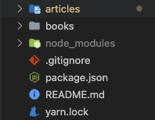
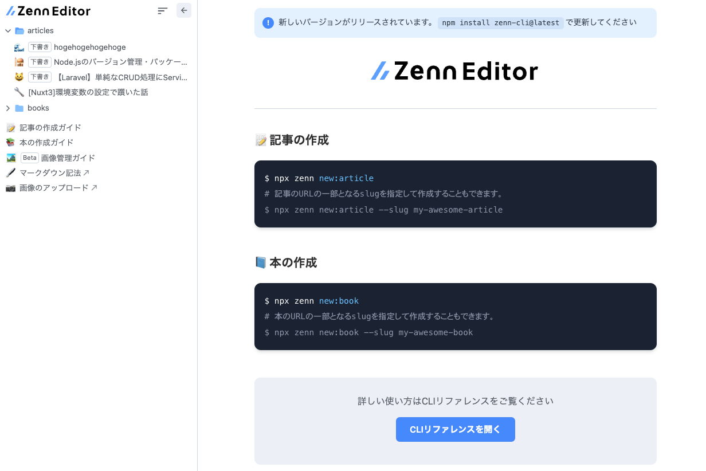

# Zenn CLIの使い方


---

# Zenn CLIとは？

GithubとZennを連携させることで Zennに投稿する記事をGithub上で管理できる！

ローカルでプレビューもできる！

形式はmdファイル

---

# 実際の使い方

---

## 手順説明

1. まずはアカウントを作成
2. Githubに連携用の空レポジトリを作成
3. ZennからGithub連携のレポジトリに連携
4. ローカルでレポジトリを作成

---

5. git initとかnpm initとか諸々初期設定
6. ライブラリzenn-cliを導入

- `yarn init`
- `yarn add zenn-cli`
- `npx zenn init`

これで、zennの記事投稿用の雛形レポジトリができる。

---



---

# 記事の作成方法

- ターミナルで、`npx zenn new:article --slug hogehogehoge`を実行(slugは12〜50文字)
- articlesにhogehogehoge.mdが作成される。

---

中身は、

```

---
title: ""
emoji: "🌊"
type: "tech" # tech: 技術記事 / idea: アイデア
topics: []
published: false
---
 

```
published falseは下書きの状態。githubにpushしても公開されない。

---

# プレビュー機能

`npx zenn preview`で、ローカルにプレビュー用のサイトが立ち上がる!?

---




---

# Enjoy your writing!

--- 

# 参考資料

- [Zenn CLIで記事を管理する方法](https://zenn.dev/zenn/articles/zenn-cli-guide)
- [Zenn CLIをインストールする](https://zenn.dev/zenn/articles/install-zenn-cli)
- [Github連携から始めるZenn入門](https://zenn.dev/zenn/articles/install-zenn-cli)
- [Zennのスラッグ(slug)とは](https://zenn.dev/zenn/articles/what-is-slug)
- [GithubレポジトリでZennの記事を管理する](https://zenn.dev/zenn/articles/connect-to-github)